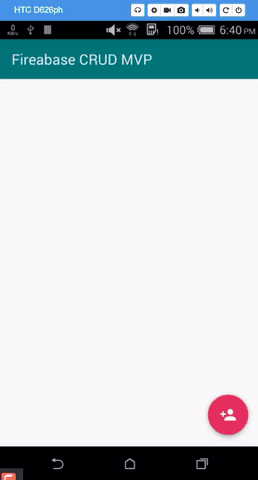
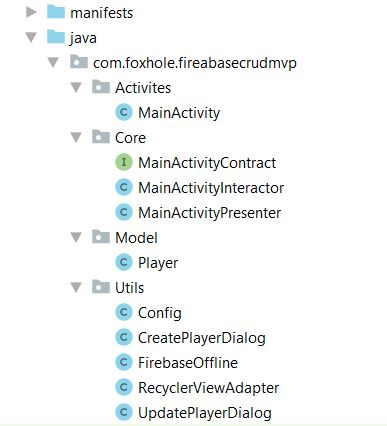

# Fireabase-CRUD-MVP

This is a android app practice project. I have implemented here android MVP architecture pattern using Firebase Database.

## Used Component
-RecyclerView And CardView  
-Firebase Database  
-AndroidX  
-Used language Java

## App overview 

## Project Structure 

## Tutorial Link
#Full Project Demo : https://youtu.be/cHlRK-00BI0

#Project Preparation: https://youtu.be/s2rP-jcfQmg

#Create Data : https://youtu.be/zE7wG4D48h0

#Reading Data : https://youtu.be/ylqHVhGDeiM

#Updating Data : https://youtu.be/rJntxQlwZs8

#Deleting Data : https://youtu.be/xC-vV_sTTgM

#Firebase Offline Capabilities : https://youtu.be/iQVyPRsKd4M
